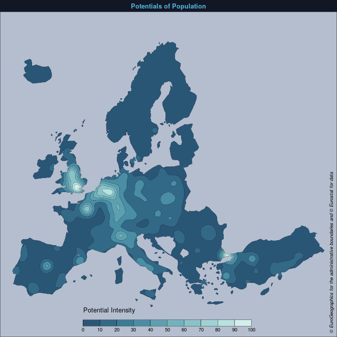

# potential

[](https://github.com/riatelab/potential/actions)

This package provides functions to compute potential models as defined
by Stewart (1941). Several options are available to customize the
models, such as the possibility to fine-tune the distance friction
functions or to use custom distance matrices. Some computations are
parallelized to improve their efficiency.

## Installation

### From GitHub

Development version / unstable

``` r
require(remotes)
remotes::install_github("riatelab/potential")
```

## Demo

``` r
library(sf)
```

    ## Linking to GEOS 3.7.1, GDAL 3.1.2, PROJ 7.1.0

``` r
library(potential)
library(cartography)
# create a regular grid
y <- create_grid(x = n3_poly, res = 20000)

# compute potentials
pot <- mcpotential(
  x = n3_pt, y = y,
  var = "POP19",
  fun = "e", span = 75000,
  beta = 2, limit = 250000
)
y$pot <- pot / max(pot) * 100

# create equipotential areas
equipot <- equipotential(y, var = "pot", mask = n3_poly)

# map potentials
par(mar = c(0, 0, 1.2, 0), bg = "#b5bece")
choroLayer(equipot, var = "center", breaks = seq(0,100,length.out = 11), 
           col = hcl.colors(10, 'teal'),
           border = "#121725", legend.pos = "bottom", 
           lwd = .2, legend.title.txt = "Potential Intensity",
           legend.horiz = T)
layoutLayer(title = "Potentials of Population", 
            col = "#121725", coltitle = "#4dB8da",
            sources = "© EuroGeographics for the administrative boundaries and © Eurostat for data",
            horiz = F, postitle = "center", scale = F)
```

<!-- -->

## Note

This package provides access to the revamped potential-related functions
initialy offered by
[`SpatialPosition`](https://CRAN.R-project.org/package=SpatialPosition).

## References

<div id="refs" class="references">

<div id="ref-STEWART41">

Stewart, John Q. 1941. “An Inverse Distance Variation for Certain Social
Influences.” *Science* 93 (2404): 89–90.
<https://doi.org/10.1126/science.93.2404.89>.

</div>

</div>
